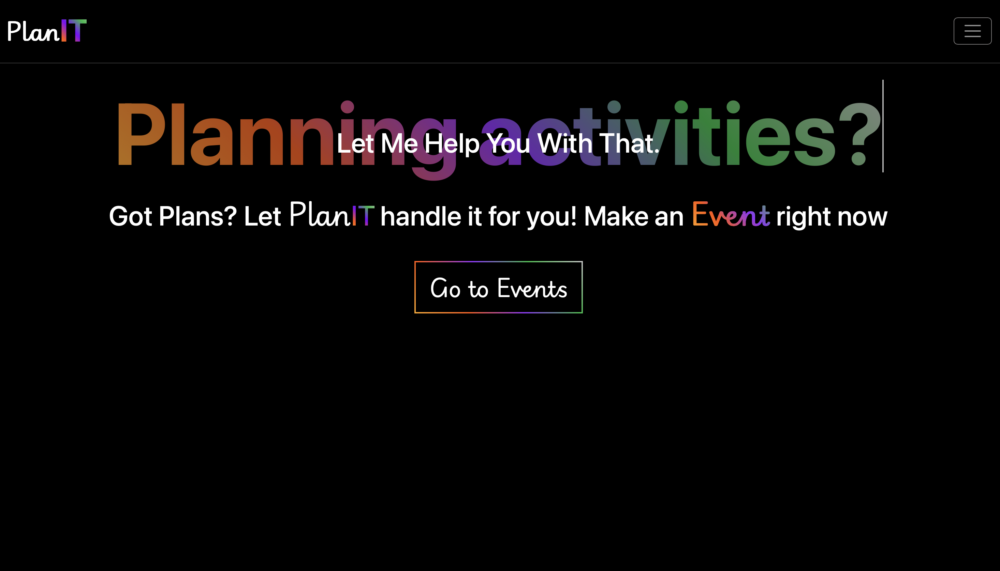
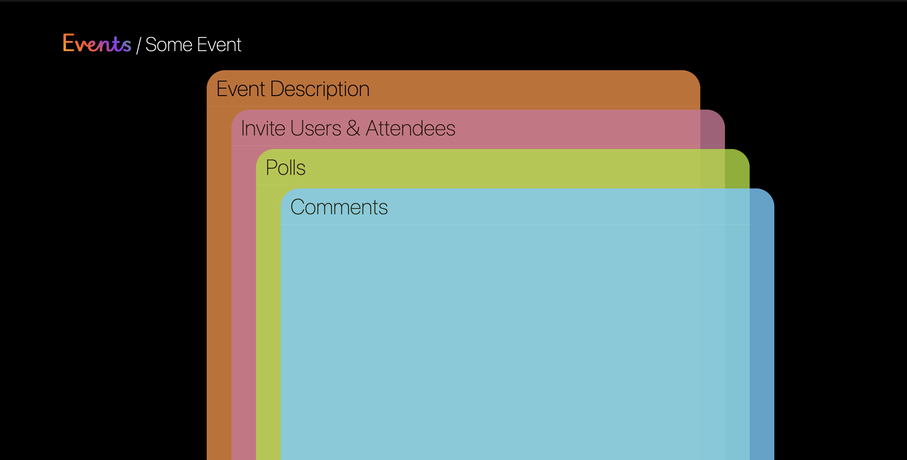
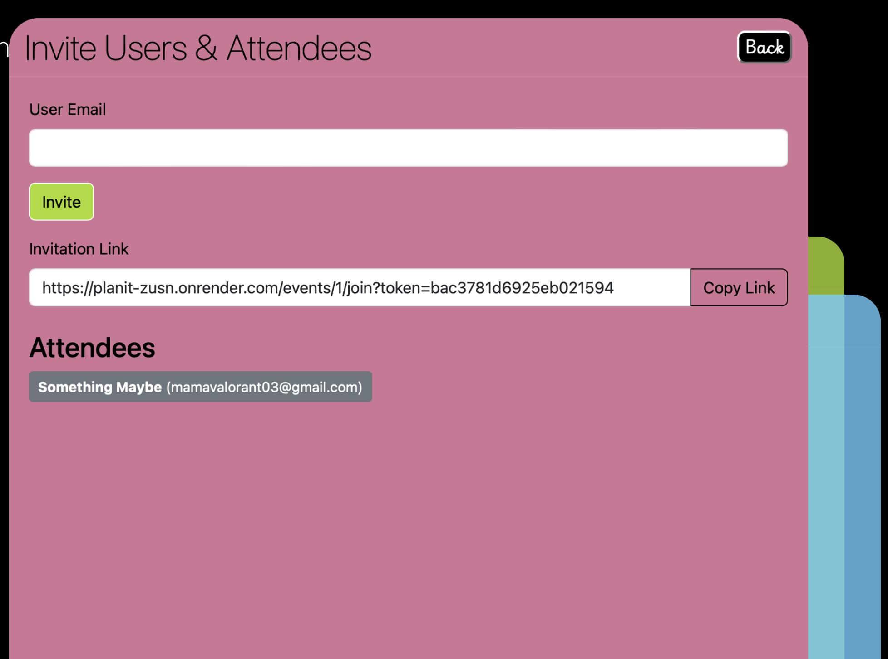
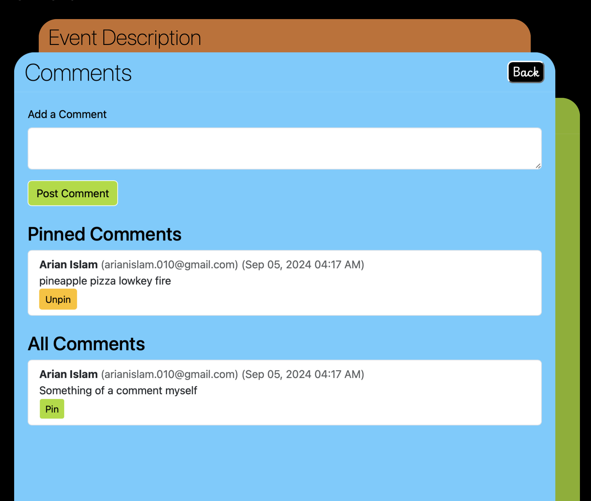
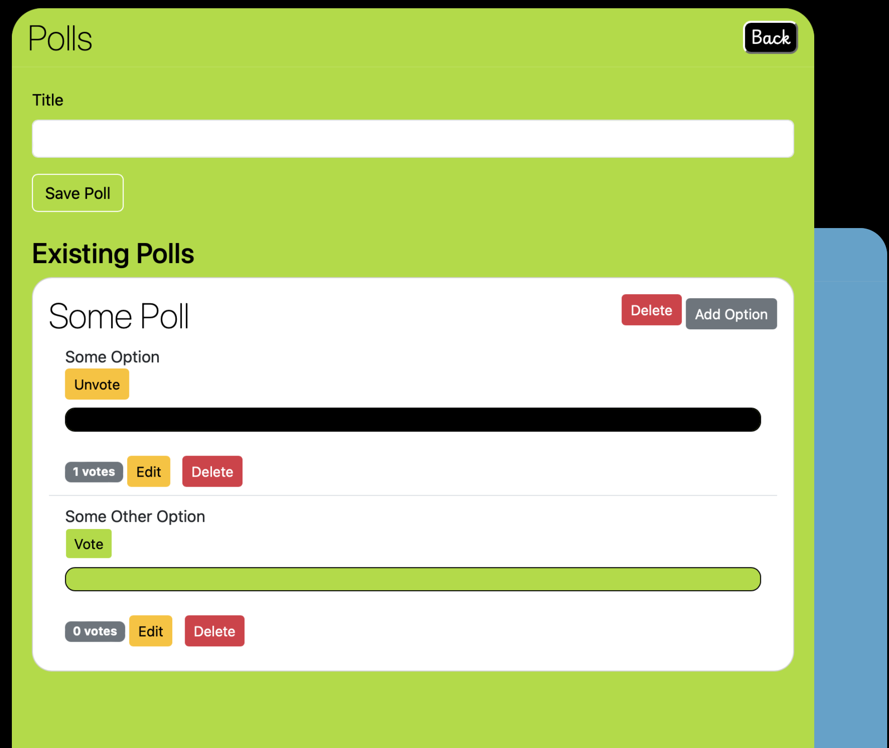
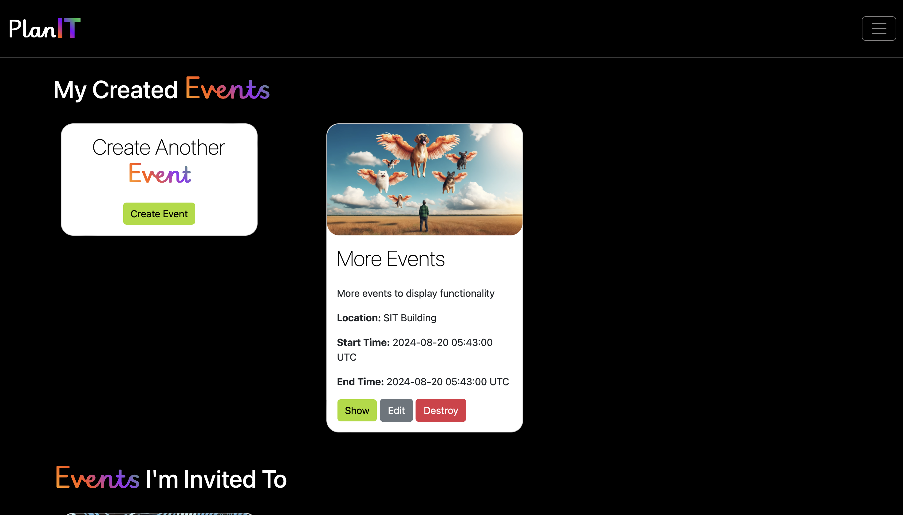

# PlanIT

PlanIT is a Ruby on Rails application that allows users to create events, invite others, and manage events through features such as comments, polls, and invitations. Users can interact with events, participate in polls, and leave comments on the events they are invited to or have created.

The project is being hosted in a free hosting service for now called 'Render'. The free tier of this service causes the web-app to spin down when inactive and it might take up to 50 seconds to spin back up again. With that being said, this web-app can be tried out in the following link:

[Click Me to go to PlanIt!](https://planit-zusn.onrender.com)

## Features

- **User Authentication**: Users can sign up, log in, and confirm their accounts via email. Users must be logged in to interact with events.
- **Create and Manage Events**: Users can create events with details such as the title, description, location, start and end times, and more. Event creators can edit or delete their events. The following images are that of the Home Page and the inside of an event page respectively - 

<div style="text-align: center;">
  <div style="display: inline-block; margin: 10px;">
    
  </div>
  <div style="display: inline-block; margin: 10px;">
    
  </div>
</div>

- **Invitations**: Users can invite other registered users by email to join their events. Invitees can accept invitations and participate in the event. The following images are that of the invitation tile and invited events displayed in the central events-dashboard

<div style="text-align: center;">
  <div style="display: inline-block; margin: 10px;">
    
  </div>
  <div style="display: inline-block; margin: 10px;">
    
  </div>
</div>

- **Comments**: Users can comment on events they are part of. Event creators can pin comments, and comments are divided into pinned and unpinned sections.
- **Polls**: Event creators can create polls, allowing attendees to vote on various options. Users can only vote once on each poll option, and votes can be removed. The following images are of Comments and Polls tiles respectively - 

<div style="text-align: center;">
  <div style="display: inline-block; margin: 10px;">
    
  </div>
  <div style="display: inline-block; margin: 10px;">
    
  </div>
</div>

- **Account Verification**: Users must verify their accounts via a verification code sent to their email upon registration.
- **User Dashboard**: Users can view events they created and events they have been invited to on their dashboard. The following image is of the User Dashboard - 

<div style="text-align: center;">
  
</div>


## Getting Started

### Prerequisites

Make sure you have the following installed:

- Ruby 3.1.2
- Rails 7.1.x
- PostgreSQL

### Installation

1. Clone the repository:

   ```bash
   git clone https://github.com/your-username/PlanIT.git
   cd PlanIT
   ```

2. Install the required gems:

   ```bash
   bundle install
   ```

3. Set up the database:

   ```bash
   rails db:create
   rails db:migrate
   ```

4. Seed the database with sample data (optional):

   ```bash
   rails db:seed
   ```

5. Start the Rails server:

   ```bash
   rails server
   ```

6. Visit the application at `http://localhost:3000`.

### Testing

To run the test suite:

```bash
rails test
```

## Project Structure

### Controllers

- **ApplicationController**: Manages user authentication and account verification.
- **EventsController**: Handles event creation, editing, viewing, and deletion. Allows users to invite others and join events.
- **CommentsController**: Manages adding comments to events and pinning important comments.
- **PollsController & PollOptionsController**: Allows event creators to create polls and options, and users to vote on these options.
- **VerificationsController**: Manages user account verification through a verification code.
- **VotesController**: Handles casting and removing votes for poll options.

### Models

- **User**: Represents a registered user. Users have authentication details, names, and a phone number.
- **Event**: Represents an event with a title, description, location, and time details. Events are associated with creators and attendees.
- **Comment**: Represents a comment made by a user on an event. Comments can be pinned.
- **Poll & PollOption**: Represents a poll associated with an event, allowing event participants to vote on specific options.
- **Vote**: Represents a vote cast by a user on a poll option.
- **EventUser**: Manages the relationship between events and users, storing invitation tokens and attendance status.

### Database Schema

The database schema includes the following key tables:

- **users**: Stores user details, including first name, last name, email, and account verification information.
- **events**: Stores event details, including title, description, location, and creator information.
- **comments**: Stores comments associated with events.
- **polls & poll_options**: Stores event polls and their associated voting options.
- **votes**: Stores votes cast by users on poll options.
- **event_users**: Manages event invitations and attendance.

## Usage

- **Creating an Event**: After logging in, users can create a new event by providing the event title, description, location, and time details.
- **Inviting Users**: Once an event is created, the event creator can invite other users by their email addresses.
- **Adding Comments**: Event participants can add comments to the event discussion.
- **Creating and Voting on Polls**: Event creators can create polls, and event participants can cast votes on poll options.

## License

This project is licensed under the MIT License - see the [LICENSE](LICENSE) file for details.

You can copy and paste this directly into your `README.md` file for **PlanIT**.
